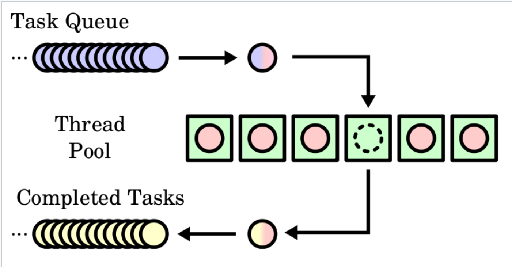
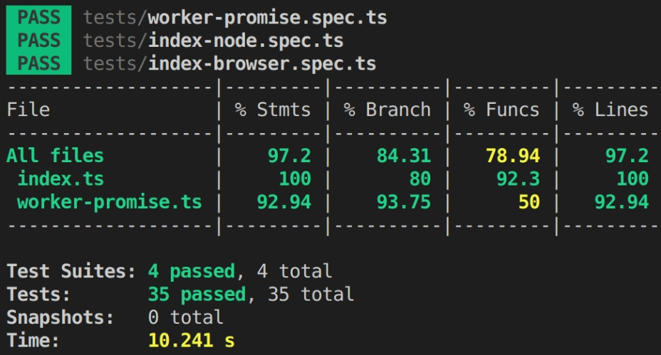

# parallelizer-function

An npm package for running JavaScript functions in a different Thread. This implementation uses the Worker API. It works for both browsers and NodeJs. Based on the run environment, it uses the Nodejs build-in library "worker_threads" or the default window.Worker class in case of a browser environment.

- [parallelizer-function](#parallelizer-function)
  - [1- Installation](#1--installation)
  - [2- Usage](#2--usage)
    - [2.1- Using the thread pool](#21--using-the-thread-pool)
    - [2.2- Model implemented](#22--model-implemented)
  - [3- Testing](#3--testing)
  - [4- Examples](#4--examples)
    - [4.2 - GitHub examples node app, react app, vanilla app, vue app](#42---github-examples-node-app-react-app-vanilla-app-vue-app)
    - [4.2 - Stackblitz](#42---stackblitz)
  - [5- Limitations](#5--limitations)
  - [6- Examples](#6--examples)
    - [6.1 - Example of image processing](#61---example-of-image-processing)
  - [7 - Conclucion](#7---conclucion)
  - [8 - Note](#8---note)
  - [Author](#author)
  - [License](#license)

## 1- Installation

npm

```sh
 npm i parallelizer-function --save
```

yarn

```sh
 yarn add parallelizer-function
```

## 2- Usage

There are two main core parts of the library, the function **workerPromise**, which allow executing a function in a separate thread, and the **pool** object, which implements a Thread Pool that runs every task with a set predefined max number of threads or workers. It implements an async queue to execute the function once an available worker has finished its current work.
The **Pool** class allows you to run your functions in a separate thread, so that it does not block the main thread. It also allows you to limit the number of concurrent threads, so that your application does not overload the system.

```TypeScript
const { workerPromise } = require("parallelizer-function");

const longRunningTask = (n) => {
  let result = 0;
  for (let i = 0; i < n; i++) {
    result += i;
  }
  return result;
}

async function main() {
    // workerPromise(fn: (...params: any[]) => any, args: any[] = []): Promise<any>
    workerPromise(longRunningTask,[1_000_000])
        .then((res)=>{console.log(res)})
        .catch((error)=>{console.error(error)})

    /// or using try-catch
    try{
        let res = await workerPromise(longRunningTask,[1_000_000]);
        console.log(res);
    }catch(error){
        console.error(error)
    }
}


```

### 2.1- Using the thread pool

The **pool** also allows you to limit the number of concurrent threads, so that your application does not overload the system. This is useful for running long-running tasks, such as image processing, and running a large number of tasks concurrently.

```typescript
const { Pool, pool } = require('parallelizer-function');

// It you want to maintain the global state of the pool use the object pool, but you can define a new Object: const newPool =  new Pool(2)

pool.setMaxWorkers(2); // Set the maximum number of worker threads for the global object pool

const longRunningTask = (n) => {
  let result = 0;
  for (let i = 0; i < n; i++) {
    result += i;
  }
  return result;
};

const heavyImageProcessing = (imageData: ImageData) => {
  for (let i = 0; i < imageData.data.length; i += 4) {
    // This is a heavy operation that will block the main thread
    imageData.data[i] = imageData.data[i] * 2;
    imageData.data[i + 1] = imageData.data[i + 1] * 2;
    imageData.data[i + 2] = imageData.data[i + 2] * 2;
  }
  return imageData;
};

async function main() {
  //pool.exec(fn: (...params: any[]) => any, args: any[]): Promise<any>
  try {
    let res = await pool.exec(longRunningTask, [1_000_000]);
    console.log(res);
  } catch (error) {
    console.error(error);
  }

  /// You can use Promise.all to run several tasks

  try {
    Promise.all([
      pool.exec(longRunningTask, [1_000_000]),
      pool.exec(longRunningTask, [2_000_000]),
      pool.exec(heavyImageProcessing, [imageData]),
    ]).then((res) => {
      console.log(res);
    });
    console.log(
      'This function will be executed very fast, the above heavy tasks will not block the main thread'
    );
  } catch (error) {
    console.error(error);
  }
}
```

### 2.2- Model implemented

Here you can appreciate an ilustration of the thread pool implemented.



## 3- Testing

**We have run several unit tests that cover error handling, expected behavior, rejections, memory leaks, concurrency states, and more. Here I share with you a snapshot of coverage with jest:**



## 4- Examples

### 4.2 - GitHub examples node app, react app, vanilla app, vue app

1. [Example performing several long computation in NodeJS environment](https://github.com/josealejandro2928/parallelizer-function/tree/master/examples/node-example)
2. [Example using in a React application](https://github.com/josealejandro2928/parallelizer-function/tree/master/examples/react-test)
3. [Example using in another a React application](https://github.com/josealejandro2928/parallelizer-function/tree/master/examples/react-test-2)
4. [Example in a Vanilla JS application](https://github.com/josealejandro2928/parallelizer-function/tree/master/examples/vanilla-js)
5. [Example in a Vue 3 application with Composition](https://github.com/josealejandro2928/parallelizer-function/tree/master/examples/vue-test)

**Using the package in an Angular application does not work for the moment because of the Webpack transformation over the functions. The package loses the correct toString() version of the part to execute in the worker thread.**

### 4.2 - Stackblitz

1. [stackblitz example in a react application](https://stackblitz.com/edit/parallelizer-function-example-react?file=src/App.tsx)

2. [stackblitz example in a node application](https://stackblitz.com/edit/parallelizer-function-example-node?file=index.js)

## 5- Limitations

1. The worker function must be able to be stringified or cloned (e.g. cannot be a class method)
2. The toString() method of the function should be the same of the function definition.
3. All the libraries or packages the function uses in performing its task should be imported inside the function. This is becouse workers run in another global context that is different from the current window. The function will be isolated as if it were in a separate script.
4. You can run whatever code you like inside the worker thread, with some exceptions. For example, you can't directly manipulate the DOM from inside a worker, or use some default methods and properties of the window object

Here an example where we want to process a text file and return its content as a list
of rows

```TypeScript
import { pool } from "parallelizer-function";
import path from "path";

//////////// main script
try{
    let pathToFile = path.resolve("../docs/sample-name.txt");

    let res:Array<string> = await pool.exec(
        async (pathFile)=>{
            const fs = require('fs');
            let files = fs.readFileSync(pathFile, { encoding: 'utf-8' });
            return files.split('\n');
        }, [pathToFile]);

    console.log("Names: ", res)
}catch(error){
    console.error(error)
}
```

## 6- Examples

Here are some examples of how you might use this package in your application:

1. Running a long-running task, such as image processing, in a separate thread to prevent it from blocking the main thread.
2. Running a large number of tasks concurrently, but limiting the number of threads to prevent the system from becoming overloaded.
3. Running a task in a separate thread and using a callback function to retrieve the result

Let's imagine we have this sample of functions we want to compute on a website or respond to a request using an express server.

```TypeScript
import { Pool } from "parallelizer-function";

let pool = new Pool(4); // Here we instanciate another instance of Worker Pool and we set a pool of 4 workers

function isPrimeThisNumber(n){
    // This function takes an integer and returns whether it is a prime number or not. Complexity O(n^1/2)
    for(let i=2;i*i<=n;i++){
        if(n%i == 0) return false;
    }
    return true
}

function TripleSum(arr=[]){
    // This function return all the distinc triplet i,j,k i<j<k,
    // where arr[i] + arr[j] + arr[k] sum up to 0. Complexity O(n^2)
    let visited = new Set()
    let sol = []
    arr = arr.sort()
    for(let i =0;i<arr.length;i++){
        let target = -arr[i]
        let isSeen = new Set()
        for(let j=i+1;j<arr.length;j++){
            if(isSeen.has(target - arr[j])){
                let key = `${arr[i]},${arr[j]},${target - arr[j]}`
                if(!visited.has(key))
                    sol.push([arr[i],arr[j],target - arr[j]])
                visited.add(key)
            }else{
                isSeen.add(arr[j])
            }

        }
    }
    return sol
}

function simulateLongTask(delayS = 10){
    // This function simulate a task that will take <delayS> seconds to finish
    let now = Date.now();
    let iter = 0;
    let MAX_DELAY = delayS * 1000; // 10 seconds 100000 milliseconds
    while((Date.now() - now) < MAX_DELAY ){
        iter++;
    }
    return iter;
}

```

If you have a listener to react to the click button or an endpoint API and the inputs for the functions are bigger enough. The following snippets code will block the main thread of JS; which will cause a web site becomes unresponsible or an API that will not accept more incoming requests.

```TypeScript
someBTNEl.addEventListener("click",()=>{
    console.log(isPrimeThisNumber(352684978))
    /// This will block the main thread
})
// Also this

someBTNEl.addEventListener("click",()=>{
    let promiseFn = new Promise((resolve)=>{
        resolve(isPrimeThisNumber(352684978));
    })
    promiseFn.then(console.log);
    /// This also will block the main thread.
    // Wrapping normal code in a Promise does not guarantee that the main thread will not be blocked.
})
```

using **pool** we can avoid the bloking of the EventLopp for the above functions.

```TypeScript
someBTNEl.addEventListener("click",async ()=>{
    try{
        let res = await pool.exec(isPrimeThisNumber,[352684978]);
        console.log(res);
    // This will not block the main thread of JS, it will run "isPrimeThisNumber"
    // in a separate thread using Worker class.

    }catch(error){

    }

})
// You can do all computation in once
someBTNEl.addEventListener("click",async ()=>{
    Promise.all([
        pool.exec(isPrimeThisNumber,[352684978]),
        pool.exec(simulateLongTask,[10])
    ]).then((isPrime,sum] )=>{
        /// do more stuff
    })
})

// Or in and endpoind for the computation of the functions
let functions = {
    TripleSum,
    isPrimeThisNumber,
    simulateLongTask
}

app.post("/compute/:fn",(req,res)=>{
    let fn = req.params.fn;
    if(!fn || !(fn in functions)){
        return res.status(401).json({msg:"Not found the function"});
    }
    try{
        let res = await pool.exec(functions[fn],req.body?.args || []);
        // This will not block the main thread of JS, it will run
        return res.status(200).json({ error:false,msg:"OK",data:res });
    }catch(e){
        return res.status(400).json({ error:true,msg:e.message });
    }
})
```

### 6.1 - Example of image processing

```TypeScript

import { pool } from "parallelizer-function";

const heavyImageProcessing = (imageData: ImageData) => {
  for (let i = 0; i < imageData.data.length; i += 4) {
    // This is a heavy operation that will block the main thread
    imageData.data[i] = imageData.data[i] * 2;
    imageData.data[i + 1] = imageData.data[i + 1] * 2;
    imageData.data[i + 2] = imageData.data[i + 2] * 2;
  }
  return imageData;
};

const processImage = async (image: HTMLImageElement) => {
  const canvas = document.createElement('canvas');
  canvas.width = image.width;
  canvas.height = image.height;
  const ctx = canvas.getContext('2d');
  ctx.drawImage(image, 0, 0);
  const imageData = ctx.getImageData(0, 0, canvas.width, canvas.height);

  // This will block the main thread
  const processedImageData = heavyImageProcessing(imageData);
  ctx.putImageData(processedImageData, 0, 0);

  return canvas.toDataURL();
};

const processImageInWorker = async (image: HTMLImageElement) => {
  const canvas = document.createElement('canvas');
  canvas.width = image.width;
  canvas.height = image.height;
  const ctx = canvas.getContext('2d');
  ctx.drawImage(image, 0, 0);
  const imageData = ctx.getImageData(0, 0, canvas.width, canvas.height);

  // This will not block the main thread
  const processedImageData = await pool.exec(heavyImageProcessing, [imageData]);
  ctx.putImageData(processedImageData, 0, 0);

  return canvas.toDataURL();
};
```

In the above example, processImage will block the main thread, causing the user interface to freeze and the application to become unresponsive. On the other hand, processImageInWorker uses the Pool class to execute the heavy image processing task in a separate worker thread, allowing the main thread to continue executing and providing a better user experience.

## 7 - Conclucion

The thread pool allows you to run your functions in separate threads, so they do not block the main thread. It also allows you to limit the number of concurrent threads, so that your application does not overload the system. This is useful for running long-running tasks, such as image processing, and running a large number of tasks concurrently.

## 8 - Note

This package has been tested on Node.js v14.x v16.x, v18.x and in browser like Mozilla and Chrome using Vanilla JavaScript, React and Angular

## Author

author: [Jose Alejandro Concepcion Alvarez](https://www.npmjs.com/~jalejandro2928)
github: [Github](https://github.com/josealejandro2928)

## License

This project is licensed under the MIT License.
